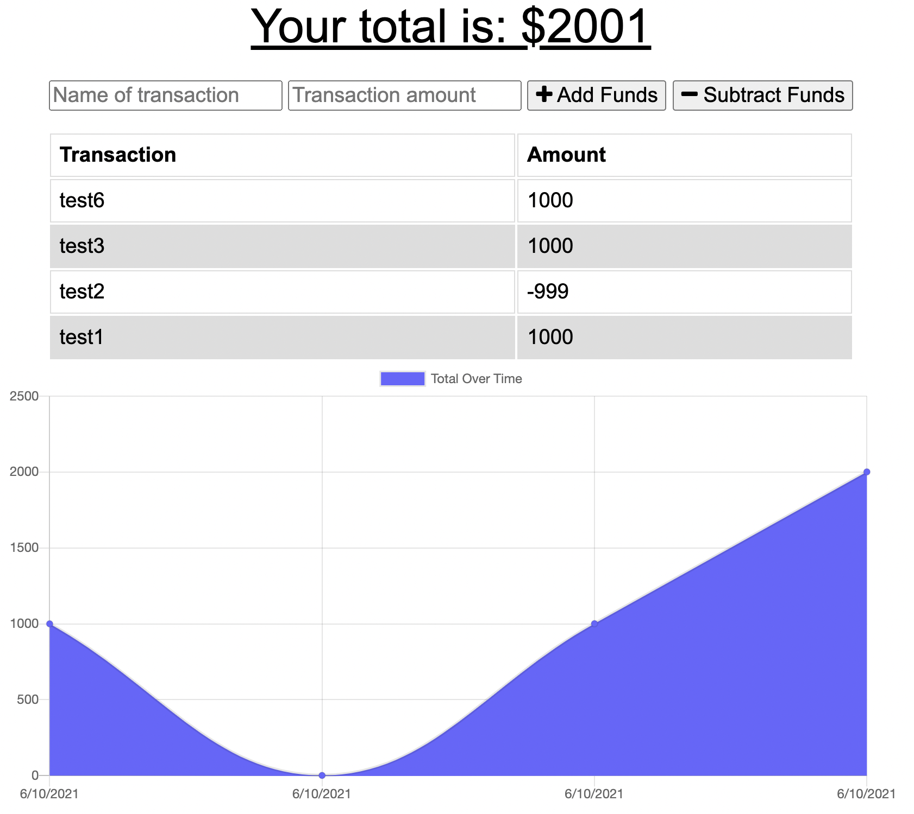

# Budget Tracker Application

[Link to Live App](https://evening-springs-37653.herokuapp.com/)

## Table of contents
1. [Introduction](#introduction)
2. [Installation](#installation)
3. [Contributions](#contributions)
4. [Contact](#contact)

## Description 
This project uses mongoose and MongoDB to store transaction history. Though it's a simple app, it's greatest strength is storing the information in the cache so it's wicked fast upon reloading and it can also be used offline. The user simply enters the data as normal and then when they're able to reconnect to the network, the cached information is pushed to the database to be stored. 

### Motivation
This project is motivated by enabling the user, especially those who like to travel, to still have an app that will work to help them keep track of their budget whether they're deep in the desert or somewhere in the mountains. They can still keep track of all their information, and once they reconnnect to the network, all their information will be saved to the database.

### Problem Solved
This MVP will allow a user without constant internet access to store their transaction history (both positive and negative) to keep trac of their budget.
	
## Installation 
1.  Clone or download .zip file from Github to your local computer
2.  Make sure to navigate to the correct directory
3.  Run “npm init -y” and then 
4.  “npm install” 
5.  Simply run “node index.js” or “node .”

### <ins>Cloning</ins>
1. From Github, select the "Code" button, choose either HTTPS or SSH as appropriate
2. Click the copy button to add it to your clipboard
3. In your preferred command line (terminal, bash, etc), navigate to the folder you'd like to download the repository into
4. Type `git clone [pasted url from clipboard]` and press enter
5. Access the content with your code editor by either typing `code .` in your command line or by using your editor's `File > Open Folder` in your code editor menu. If only viewing in a browser, simply double click index.html to open in your default browser

### <ins>Zip file</ins>
1. From Github, select the "Code" button, then select "Download ZIP"
2. Choose which folder to download the repository into via the dialog box that appears
3. After downloading, open the .zip file and select "Extract All" from the top of the window that appears
4. Access the content with your code editor by selecting `File > Open Folder` in your code editor menu. If only viewing in a browser, simply double click index.html to open in your default browser

## Usage
After installing the project, make sure to navigate to the correct directory and run “npm init -y” and then “npm install” After you’ve got the project ready, simply run “node index.js” or “node .” Answer the questions as they appear in the terminal and you can find your new file in the 'dist' directory.

## License 
This project is licensed under the The MIT License. Click the link below to learn more about how you can use this project.
[License: MIT](https://opensource.org/licenses/MIT)

## Features 
The main feature of this project is how it connects with an ATLAS mongo database to store information and can update all the info upon connection to the network. It also utilizes chart.js to display current amount and change in funds.

## Contribution Guidelines 
The best way to contribute to this project is to fork the repo to your own GitHub profile and test new features or make adjustments yourself. I am naturally collaborative and would be grateful for any input.
For more information see the [Contributor Covenant](https://www.contributor-covenant.org/)

## Questions 
If you have any questions or issues you can find my github profile [here](www.github.com/jayyousef) => www.github.com/jayyousef

You can also contact me at my [email address](mailto:jay.yousef@gmail.com): jay.yousef@gmail.com